<p align="center">
 <h1 style="color: #3f51b5" align="center"> ZHOUYI·ADMIN</h1>
  </p>

<h3 align="center">" 🔥 ZHOUYI·ADMIN ( 纯前端 ) "</h3>
  <p align="center">
    基于 Vue3 + ElementPlus + JavaScript + Pinia +Vite.搭建
    <br />
    <a href="https://gitee.com/Z568_568/ZHOUYI-ADMIN.git" target="_blank"><strong>探索本项目的源码 »</strong></a>
<a href="https://template.zhouyi.run" target="_blank"><strong>在线示例点这里 »</strong></a>
    <br />
<p align="center">
ZHOUYI·ADMIN 是一个现代化的管理后台模板，提供了一系列功能丰富的组件和工具，帮助开发者快速搭建和开发前后台管理应用。
对快速构建Vue3全栈项目有很大的帮助，解决每次新建项目基础配置的烦恼.

无论你是一个开发者寻找一个可靠的管理后台模板，还是一个学习者想要深入了解现代前端技术， ZHOUYI·ADMIN 都是一个非常有价值的项目。
因为它弥补了不习惯使用TypeScript开发的同学，
**使用JavaScript版本就能更快上手熟悉** 。
<p align="center">
✌️项目如果对您有帮助，希望能得到您的 star ✨


    
<br />
 


[](https://choosealicense.com/licenses/mit/)

</p>


## 截图
  <p align="center">
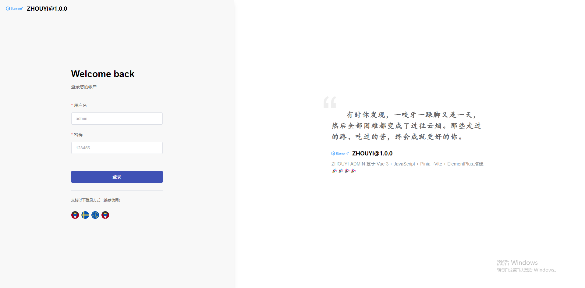
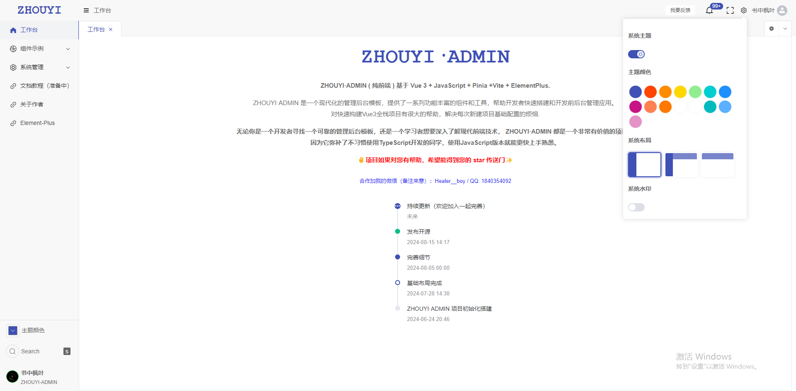
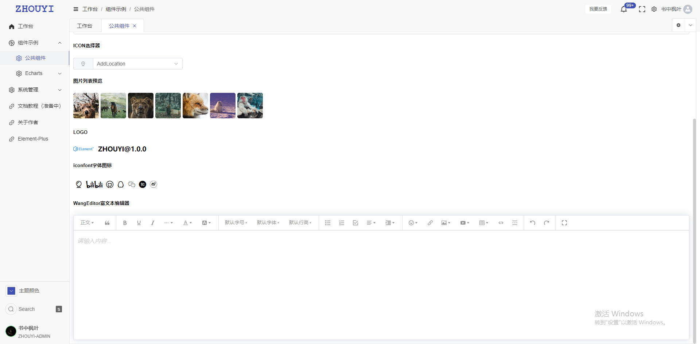
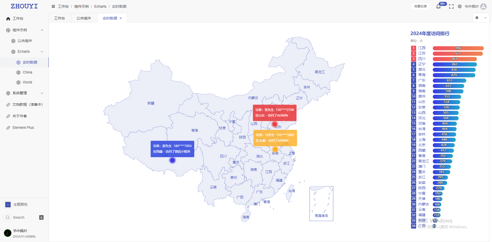
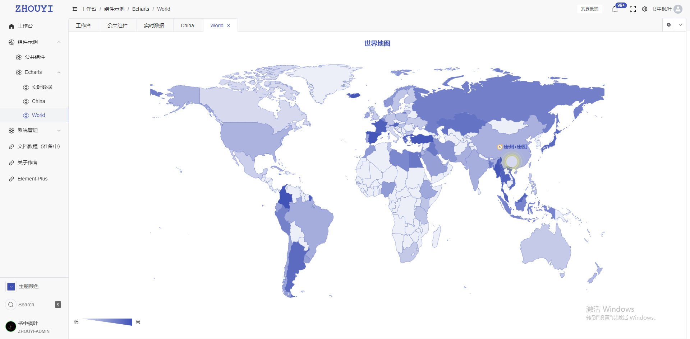
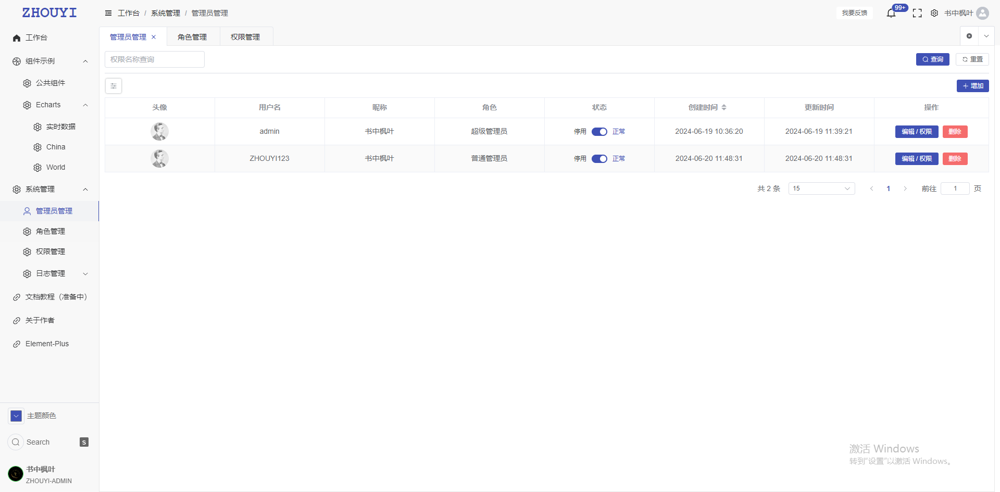
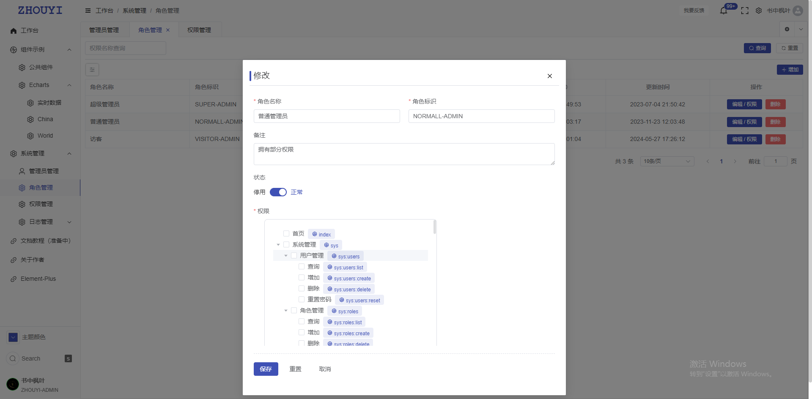
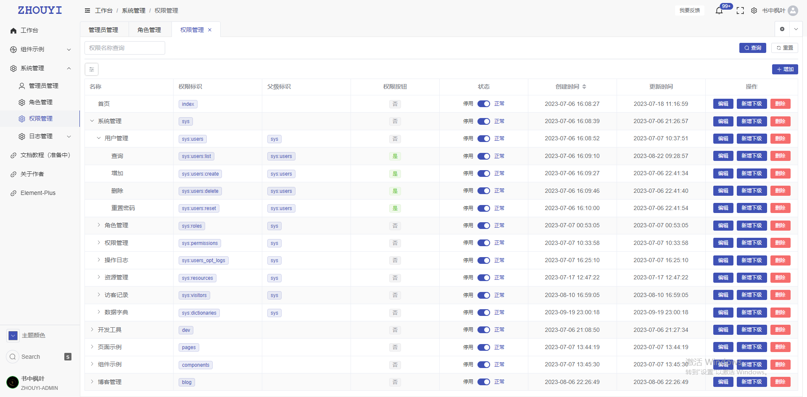
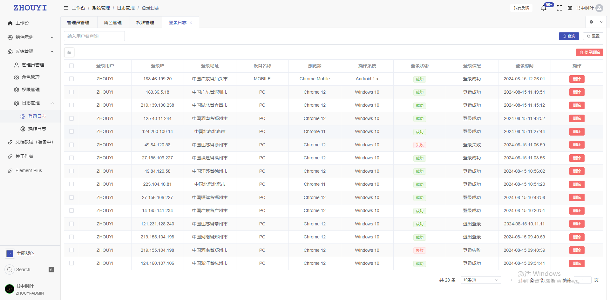
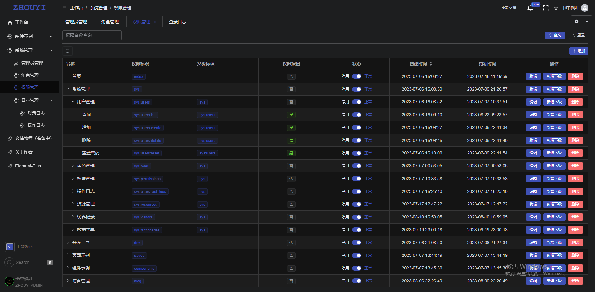
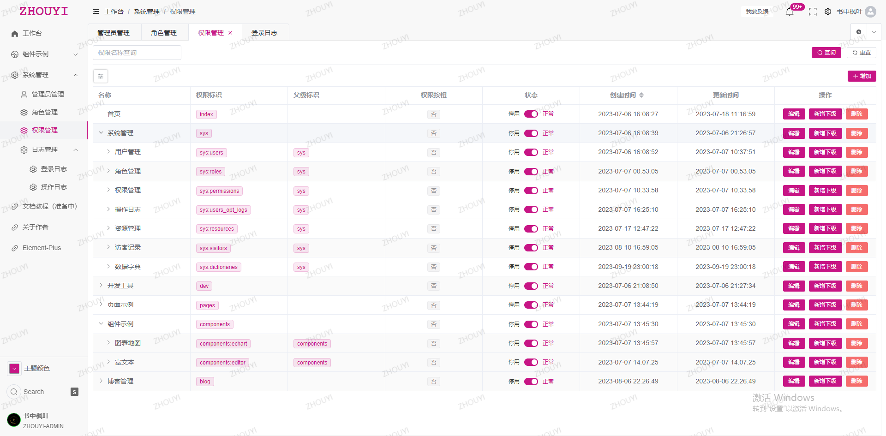
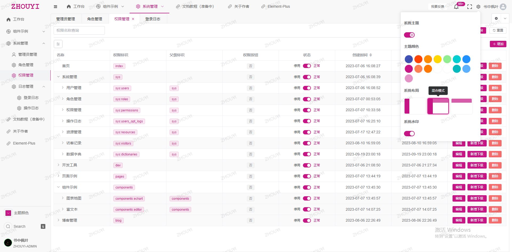
</p>

## 快速开始
默认你的电脑已经安装好`Nodejs` `Vue3`  以及代码编辑器等环境
我的环境配置可参考：

``` shell
Nodejs : v20.11.0
```

1. 克隆本仓库到本地

   ```
   git clone https://gitee.com/Z568_568/ZHOUYI-ADMIN.git
   ```

2. 安装依赖

   ```
   npm install
   ```
3. 启动

   ```
   npm run dev
   ```

4. 打包生产环境

   ```
   npm run build
   ```

## 添加新页面

1. 增加菜单

```js
/**
 * @Description: 路由项说明
 * @Author: ZHOU YI
 * @Date: 2024-08-15 09:39
 *
 *  {
 *     path: "/components",          // 路由地址
 *     name: "components",           // 路由名称
 *     meta: {
 *         title: "组件示例",          // 路由标题
 *         icon: "Basketball",       // 路由图标
 *         requiresAuth: true,       // 是否需要登录
 *         cache: true,              // 是否缓存
 *         isLink: false,            // 是否外链
 *         hidden: false,            // 是否隐藏
 *         url: 'www.baidu.com',     // 内嵌地址 需要指定在 frame 组件配置
 *         perms: [                  // 权限控制
 *             "/components"         // 权限标识
 *         ],
 *     },
 *     children: []                  // 子路由
 * }
 */
```